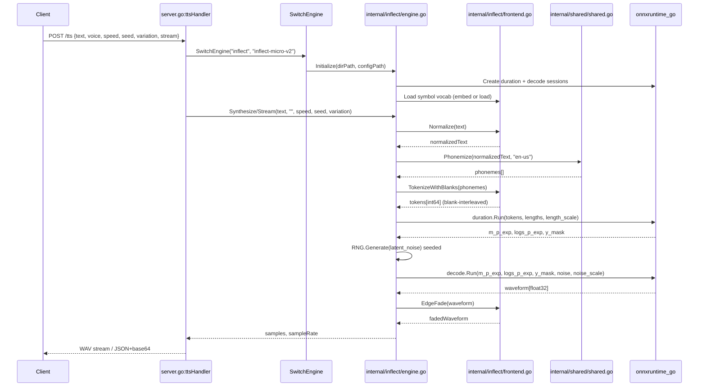
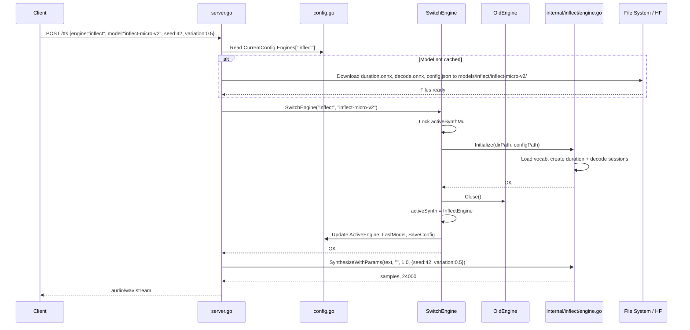

# Architecture Plan: Inflect-Micro-v2 ONNX TTS Integration into zen-tts

## Summary

This plan details the integration of **Inflect-Micro-v2 ONNX** (a 9.36M parameter, 37.75 MB, English-only, single-voice TTS model) into `zen-tts`, a Go-based multi-engine local TTS system with HTTP API, TUI, and browser userscript. Inflect offers CPU throughput of 6.28× real-time, UTMOS22 4.395, and Apache-2.0 licensing — competitive with Kokoro/Kitten on quality while being faster than Piper and lighter than most. The integration adds a fourth engine (`inflect`) alongside `piper`, `kokoro`, and `kitten`, exposing its unique controls (speed 0.5–2.0, variation 0.0–1.0, seed for determinism) via the existing API/TUI. Key constraints: Inflect requires **two ONNX models** (`duration.onnx` + `decode.onnx`), a **different phoneme vocabulary and blank-interleaved tokenization**, **Python-level text normalization** not present in other engines, and **seed/variation parameters** absent from current interfaces.

---

## System Boundaries & Component Breakdown

```mermaid
graph TD
    subgraph CLI["CLI / TUI / HTTP Entry Points"]
        Main[main.go]
        UI[ui.go]
        Server[server.go]
    end

    subgraph Config["Configuration Layer"]
        Config[config.go]
        Constants[constants.go]
    end

    subgraph EngineAbstraction["Engine Abstraction (engine.go)"]
        TTSEngine[TTSEngine Interface]
        TimingEngine[TimingEngine Interface]
        StreamingEngine[StreamingEngine Interface]
    end

    subgraph Engines["Engine Implementations"]
        Piper[internal/piper/engine.go]
        Kokoro[internal/kokoro/engine.go]
        Kitten[internal/kitten/engine.go]
        Inflect[internal/inflect/engine.go]
    end

    subgraph Shared["Shared Runtime (internal/shared/shared.go)"]
        ONNX[InitONNXRuntime]
        Phonemize[Phonemize via piper_phonemize]
        Tokenize[Tokenize / TokenizeWithVoice]
        Timing[SilenceBoundaryTimings]
    end

    subgraph InflectFrontend["Inflect-Specific Frontend (internal/inflect/frontend.go)"]
        Normalize[Text Normalization]
        InflectPhonemize[Phonemize Wrapper]
        InflectTokenize[Tokenization with Blanks]
        Chunking[Punctuation-Aware Chunking]
    end

    Main --> Config
    Main --> Server
    Main --> UI
    Server --> Config
    Server --> EngineAbstraction
    Server --> Shared
    EngineAbstraction --> Piper
    EngineAbstraction --> Kokoro
    EngineAbstraction --> Kitten
    EngineAbstraction --> Inflect
    Inflect --> Shared
    Inflect --> InflectFrontend
    Piper --> Shared
    Kokoro --> Shared
    Kitten --> Shared
    Config --> Constants
```

### New Components

| Component | Path | Responsibility |
|-----------|------|----------------|
| Inflect Engine | `internal/inflect/engine.go` | Implements `TTSEngine` + `StreamingEngine`; manages two ONNX sessions, synthesis loop, RNG |
| Inflect Frontend | `internal/inflect/frontend.go` | Text normalization, phonemization wrapper, tokenization (blank-interleaved), chunking |
| Config Extensions | `config.go`, `constants.go` | New `EngineConfig` fields, download URLs, request struct extensions |

---

## Data Flow & State Management



### State Management

| State | Scope | Concurrency Control |
|-------|-------|---------------------|
| `activeSynth` (engine singleton) | Package `main` | `activeSynthMu sync.Mutex` in `SwitchEngine` |
| ONNX Sessions (duration, decode) | `InflectEngine` struct | **Not thread-safe** — serialize via engine-level mutex |
| RNG Source | `InflectEngine` | **Per-request seed** → new `rand.NewSource(seed)` per chunk; no shared mutable RNG |
| Seed / Variation / Speed | Request-scoped | Passed as `Synthesize` params (see Interface Extension below) |
| Voice | Ignored (single voice) | N/A |

---

## Interface Extensions (Critical — Blocking)

The current `TTSEngine.Synthesize(text, voice, speed)` signature **cannot carry** Inflect's `seed` and `variation`. Two viable paths:

### Option A: Engine-Level Mutable State (Rejected — Race Risk)
```go
// On InflectEngine
func (e *InflectEngine) SetSeed(seed int64) { e.seed = seed }
func (e *InflectEngine) SetVariation(v float32) { e.variation = v }
```
**Why rejected**: `activeSynth` is a singleton shared across goroutines. Concurrent requests with different seeds/variation would TOCTOU race between setter and `Synthesize`. Adding a mutex inside `Synthesize` around the whole call serializes all engines unnecessarily.

### Option B: Extend Request Struct + New Interface (Selected)
```go
// config.go
type TTSRequest struct {
    Text      string   `json:"text"`
    Voice     string   `json:"voice"`
    Speed     float64  `json:"speed"`
    Play      bool     `json:"play"`
    Stream    bool     `json:"stream"`
    Engine    string   `json:"engine"`
    Seed      *int64   `json:"seed,omitempty"`      // NEW
    Variation *float64 `json:"variation,omitempty"` // NEW
}

// engine.go — new interface, additive, opt-in
type ParameterizedEngine interface {
    TTSEngine
    SynthesizeWithParams(text, voice string, speed float32, params map[string]any) ([]float32, int, error)
    SynthesizeStreamWithParams(text, voice string, speed float32, params map[string]any, callback func([]float32) bool) error
}
```

**Usage in `server.go:ttsHandler`:**
```go
params := map[string]any{}
if req.Seed != nil { params["seed"] = *req.Seed }
if req.Variation != nil { params["variation"] = *req.Variation }

if pe, ok := synth.(ParameterizedEngine); ok {
    samples, sr, err = pe.SynthesizeWithParams(text, reqVoice, float32(userSpeed), params)
} else {
    samples, sr, err = synth.Synthesize(text, reqVoice, float32(userSpeed))
}
```

**Rationale**: Pointer fields distinguish "user passed 0.0" from "user didn't set" (critical: `variation=0.0` is valid). Other engines ignore unknown params. Minimal schema change, no mutable engine state, concurrency-safe.

---

## Inflect Engine Implementation Detail

### `internal/inflect/engine.go`

```go
package inflect

import (
    "math/rand"
    "sync"
    "zen-tts/internal/shared"
    ort "github.com/yalue/onnxruntime_go"
)

type InflectEngine struct {
    modelDir     string
    durationSess *ort.DynamicAdvancedSession
    decodeSess   *ort.DynamicAdvancedSession
    sampleRate   int
    mu           sync.Mutex
    vocab        map[string]int64 // symbol -> ID
}

func (e *InflectEngine) Initialize(modelDir, configPath string) error {
    // 1. Init ONNX Runtime (shared)
    if err := shared.InitONNXRuntime(); err != nil { return err }

    // 2. Load symbol vocabulary (embed or load from configPath)
    e.vocab = loadVocabulary(configPath) // see frontend.go

    // 3. Create two sessions
    durationPath := filepath.Join(modelDir, "duration.onnx")
    decodePath := filepath.Join(modelDir, "decode.onnx")

    var err error
    e.durationSess, err = ort.NewDynamicAdvancedSession(durationPath,
        []string{"tokens", "lengths", "length_scale"},
        []string{"m_p_exp", "logs_p_exp", "y_mask"}, nil)
    if err != nil { return fmt.Errorf("duration session: %w", err) }

    e.decodeSess, err = ort.NewDynamicAdvancedSession(decodePath,
        []string{"m_p_exp", "logs_p_exp", "y_mask", "zp_noise", "noise_scale"},
        []string{"waveform"}, nil)
    if err != nil {
        e.durationSess.Destroy()
        return fmt.Errorf("decode session: %w", err)
    }

    e.sampleRate = 24000
    e.modelDir = modelDir
    return nil
}

func (e *InflectEngine) SynthesizeWithParams(text, voice string, speed float32, params map[string]any) ([]float32, int, error) {
    e.mu.Lock()
    defer e.mu.Unlock()

    seed := int64(0)
    if v, ok := params["seed"].(int64); ok { seed = v }
    variation := float32(0.667)
    if v, ok := params["variation"].(float32); ok { variation = v }
    if v, ok := params["variation"].(float64); ok { variation = float32(v) } // JSON unmarshal

    // Delegate to internal chunked synthesis
    return e.synthesizeChunks(text, speed, variation, seed)
}

func (e *InflectEngine) SynthesizeStreamWithParams(text, voice string, speed float32, params map[string]any, callback func([]float32) bool) error {
    e.mu.Lock()
    defer e.mu.Unlock()
    // Same param extraction
    return e.streamChunks(text, speed, variation, seed, callback)
}

func (e *InflectEngine) synthesizeChunks(text string, speed, variation float32, baseSeed int64) ([]float32, int, error) {
    chunks := frontend.SplitText(text) // punctuation-aware
    var allSamples []float32
    for i, chunk := range chunks {
        if i > 0 {
            pause := frontend.BoundaryPauseSeconds(chunks[i-1])
            silence := make([]float32, int(pause*float64(e.sampleRate)))
            allSamples = append(allSamples, silence...)
        }
        wav, err := e.synthesizeChunk(chunk, speed, variation, baseSeed+int64(i))
        if err != nil { return nil, 0, err }
        allSamples = append(allSamples, frontend.EdgeFade(wav, e.sampleRate)...)
    }
    return allSamples, e.sampleRate, nil
}

func (e *InflectEngine) synthesizeChunk(text string, speed, variation float32, seed int64) ([]float32, error) {
    // 1. Normalize + phonemize + tokenize
    norm := frontend.NormalizeText(text)
    phonemes, err := shared.Phonemize(norm, "en-us")
    if err != nil { return nil, err }
    tokens := frontend.PhonemesToTokens(phonemes, e.vocab) // blank-interleaved

    // 2. Duration model
    tokensShape := ort.NewShape(1, int64(len(tokens)))
    tokensTensor, _ := ort.NewTensor(tokensShape, tokens)
    defer tokensTensor.Destroy()

    lengthsTensor, _ := ort.NewTensor(ort.NewShape(1), []int64{int64(len(tokens))})
    defer lengthsTensor.Destroy()

    lengthScale := float32(1.0 / speed)
    scaleTensor, _ := ort.NewTensor(ort.NewShape(1), []float32{lengthScale})
    defer scaleTensor.Destroy()

    durationOutputs := []ort.Value{nil, nil, nil}
    err = e.durationSess.Run([]ort.Value{tokensTensor, lengthsTensor, scaleTensor}, durationOutputs)
    if err != nil { return nil, err }
    m_p_exp := durationOutputs[0].(*ort.Tensor[float32])
    logs_p_exp := durationOutputs[1].(*ort.Tensor[float32])
    y_mask := durationOutputs[2].(*ort.Tensor[float32])
    defer m_p_exp.Destroy(); defer logs_p_exp.Destroy(); defer y_mask.Destroy()

    // 3. Sample latent noise with per-chunk seeded RNG
    rng := rand.New(rand.NewSource(seed))
    noise := make([]float32, len(m_p_exp.GetData()))
    for i := range noise { noise[i] = float32(rng.NormFloat64()) }
    noiseShape := ort.NewShape(m_p_exp.Shape()...)
    noiseTensor, _ := ort.NewTensor(noiseShape, noise)
    defer noiseTensor.Destroy()

    varScaleTensor, _ := ort.NewTensor(ort.NewShape(1), []float32{variation})
    defer varScaleTensor.Destroy()

    // 4. Decode model
    decodeOutputs := []ort.Value{nil}
    err = e.decodeSess.Run([]ort.Value{m_p_exp, logs_p_exp, y_mask, noiseTensor, varScaleTensor}, decodeOutputs)
    if err != nil { return nil, err }

    wavTensor := decodeOutputs[0].(*ort.Tensor[float32])
    defer wavTensor.Destroy()
    return wavTensor.GetData(), nil
}

func (e *InflectEngine) Close() error {
    e.mu.Lock()
    defer e.mu.Unlock()
    if e.durationSess != nil { e.durationSess.Destroy() }
    if e.decodeSess != nil { e.decodeSess.Destroy() }
    return nil
}

func (e *InflectEngine) SampleRate() int { return e.sampleRate }
```

### `internal/inflect/frontend.go` (Key Functions)

```go
package inflect

import (
    "regexp"
    "strings"
    "unicode"
)

// Symbol vocabulary (from Inflect runtime/text/symbols.py)
var symbols = []string{
    "_", ";", ":", ",", ".", "!", "?", "—", "…", "\"", "(", ")", "“", "”", " ",
    "̃", "ʣ", "ʥ", "ʦ", "ʨ", "ᵝ", "ꭧ",
    "A", "I", "O", "Q", "S", "T", "W", "Y", "ᵊ",
    "a", "b", "c", "d", "e", "f", "h", "i", "j", "k", "l", "m", "n", "o", "p", "q", "r", "s", "t", "u", "v", "w", "x", "y", "z",
    "ɑ", "ɐ", "ɒ", "æ", "β", "ɔ", "ɕ", "ç", "ɖ", "ð", "ʤ", "ə", "ɚ", "ɛ", "ɜ", "ɟ", "ɡ", "ɥ", "ɨ", "ɪ", "ʝ", "ɯ", "ɰ", "ŋ", "ɳ", "ɲ", "ɴ", "ø", "ɸ", "θ", "œ", "ɹ", "ɾ", "ɻ", "ʁ", "ɽ", "ʂ", "ʃ", "ʈ", "ʧ", "ʊ", "ʋ", "ʌ", "ɣ", "ɤ", "χ", "ʎ", "ʒ", "ʔ", "ˈ", "ˌ", "ː", "ʰ", "ʲ", "↓", "→", "↗", "↘", "ᵻ",
}

var symbolToID map[string]int64

func init() {
    symbolToID = make(map[string]int64, len(symbols))
    for i, s := range symbols { symbolToID[s] = int64(i) }
}

func PhonemesToTokens(phonemes []string, vocab map[string]int64) []int64 {
    var seq []int64
    for _, p := range phonemes {
        if id, ok := vocab[p]; ok {
            seq = append(seq, id)
        } else {
            // Fallback: map individual runes
            for _, r := range p {
                if id, ok := vocab[string(r)]; ok {
                    seq = append(seq, id)
                }
            }
        }
    }
    // Interleave blanks: [0, p1, 0, p2, 0, ..., pN, 0] where 0 = pad symbol "_"
    withBlanks := make([]int64, len(seq)*2+1)
    for i, id := range seq {
        withBlanks[1+i*2] = id
    }
    // withBlanks[0] and even indices stay 0 (pad)
    return withBlanks
}

// --- Text Normalization (ported from inflect_nano_v2_frontend.py) ---

var (
    // ... compile all regexes once at init ...
    // WORD_OVERRIDES, ABBREVIATIONS, PUNCT_TRANSLATION, etc.
)

func NormalizeText(text string) string {
    text = strings.Map(func(r rune) rune {
        // PUNCT_TRANSLATION mapping
    }, text)
    text = regexp.MustCompile(`\s+`).ReplaceAllString(text, " ")
    text = strings.TrimSpace(text)

    // Word overrides
    for src, dst := range wordOverrides {
        text = regexp.MustCompile(`\b`+regexp.QuoteMeta(src)+`\b`).ReplaceAllString(text, dst)
    }
    // Abbreviations
    for src, dst := range abbreviations {
        text = regexp.MustCompile(`\b`+regexp.QuoteMeta(src)).ReplaceAllString(text, dst)
    }
    // Acronyms, numbers, dates, times, money, versions, decimals, ordinals, phones...
    // Each rule applied in specific order matching Python reference
    return regexp.MustCompile(`\s+`).ReplaceAllString(text, " ")
}

// --- Chunking (ported from inference_onnx.py split_text) ---
func SplitText(text string, limit int) []string {
    // Punctuation-aware splitting at . ! ? ; :
    // Recursive split if segment > limit, prefer comma/semicolon, fallback to space
    // Returns []string chunks
}

func BoundaryPauseSeconds(prevChunk string) float64 {
    last := strings.TrimRightFunc(prevChunk, unicode.IsSpace)
    if len(last) == 0 { return 0.08 }
    switch last[len(last)-1] {
    case '?': return 0.28
    case '!': return 0.24
    case '.': return 0.22
    case ';': return 0.16
    case ':': return 0.13
    case ',': return 0.09
    default: return 0.08
    }
}

func EdgeFade(waveform []float32, sampleRate int, ms float64) []float32 {
    frames := int(float64(sampleRate) * ms / 1000.0)
    if frames <= 0 || frames > len(waveform)/2 { return waveform }
    out := make([]float32, len(waveform))
    copy(out, waveform)
    for i := 0; i < frames; i++ {
        ramp := float32(i) / float32(frames)
        out[i] *= ramp
        out[len(out)-1-i] *= ramp
    }
    return out
}
```

---

## Configuration & Download Integration

### `config.go` Changes

```go
// EngineConfig additions
type EngineConfig struct {
    Model      string  `json:"model"`
    Voice      string  `json:"voice,omitempty"`
    Speed      float64 `json:"speed,omitempty"`
    ModelPath  string  `json:"model_path,omitempty"`   // For inflect: directory containing both .onnx files
    ConfigPath string  `json:"config_path,omitempty"`
    Variation  float64 `json:"variation,omitempty"`     // NEW: default 0.667 for inflect
}

// LoadConfig defaults
CurrentConfig.Engines["inflect"] = EngineConfig{
    Model:     "inflect-micro-v2",
    Voice:     "default", // ignored, single voice
    Speed:     1.0,
    Variation: 0.667,
}
```

### `constants.go` Additions

```go
const (
    // Inflect-Micro-v2 ONNX
    InflectMicroOnnxDurationURL = "https://huggingface.co/owensong/Inflect-Micro-v2-ONNX/resolve/main/onnx/duration.onnx"
    InflectMicroOnnxDecodeURL   = "https://huggingface.co/owensong/Inflect-Micro-v2-ONNX/resolve/main/onnx/decode.onnx"
    InflectMicroConfigURL       = "https://huggingface.co/owensong/Inflect-Micro-v2-ONNX/resolve/main/config.json"
    // Nano variant URLs if needed
)
```

### `getModelPaths` / `downloadIfNeeded` Integration

```go
func getModelPaths(key string) (string, string) {
    // ...
    if strings.HasPrefix(key, "inflect") {
        localDir := filepath.Join(ModelDir, "inflect", key)
        os.MkdirAll(localDir, 0755)
        // Return directory as "modelPath", config.json as "configPath"
        return localDir, filepath.Join(localDir, "config.json")
    }
    // ...
}

func downloadIfNeededForInflect(dir string) {
    downloadIfNeeded(filepath.Join(dir, "duration.onnx"), InflectMicroOnnxDurationURL)
    downloadIfNeeded(filepath.Join(dir, "decode.onnx"), InflectMicroOnnxDecodeURL)
    downloadIfNeeded(filepath.Join(dir, "config.json"), InflectMicroConfigURL)
}
```

---

## Failure Modes & Mitigations

| Failure Mode | Detection | Mitigation |
|--------------|-----------|------------|
| **Partial model download** (duration.ok, decode.corrupt) | `Initialize` creates duration session first, then decode; if decode fails, `durationSess.Destroy()` before returning error | `SwitchEngine` only swaps `activeSynth` after *both* sessions created successfully; old engine `Close()` called on failure |
| **OOV phoneme token** (symbol not in vocab) | `PhonemesToTokens` fallback to rune-level mapping; if still missing, token dropped (logged) | Exhaustive vocab from Inflect symbols.py embedded; log warning with count of dropped tokens per request |
| **Empty/whitespace input** | `NormalizeText` returns empty string | `SynthesizeWithParams` returns `nil, 0, ErrEmptyText` before calling ONNX |
| **Chunking splits inside abbreviation** (e.g., "Dr. Smith") | Normalization runs **before** chunking (abbreviations expanded to "doctor") | Order: `NormalizeText → SplitText`; verified in golden tests |
| **Concurrent requests race on engine mutex** | `InflectEngine.mu` serializes `Synthesize*` calls | Mutex held for full synthesis (incl. ONNX runs); acceptable for 6.28× real-time CPU; document latency ceiling |
| **Seed reproducibility mismatch Go vs Python** | Not guaranteed; document clearly | Use Go's `math/rand` (PCG64 in 1.22+) seeded per-chunk; seed guarantees **Go-internal** determinism only |
| **ONNX Runtime provider selection (CPU/CUDA/DirectML)** | Current `onnxruntime_go` uses default providers | Defer to follow-up; initial release CPU-only. Add `Provider` field to `EngineConfig` later if needed |
| **Long text → many chunks → many subprocess spawns** | `shared.Phonemize` called per chunk | **Optimization**: Batch phonemization — concatenate chunks with sentinel, single `piper_phonemize` call, split results. Implement in `frontend.SplitAndPhonemize` |
| **Variation=0.0 vs unset ambiguity** | Pointer field in `TTSRequest` | `*float64` with `omitempty`; `nil` = use engine default (0.667), `0.0` = user explicitly wants deterministic |

---

## Key Decisions, Alternatives, Rejection Rationale

| Decision | Alternative Considered | Why Rejected |
|----------|------------------------|--------------|
| **Extend `TTSRequest` with `Seed*`, `Variation*` + `ParameterizedEngine` interface** | Mutable engine state (`SetSeed`/`SetVariation`) | Race condition on singleton `activeSynth`; would require global serialization or per-request engine clones (heavy) |
| **`modelPath` = directory for Inflect** | Comma-separated paths; `SecondaryModel` field | Directory is idiomatic for multi-file models; `EngineConfig.ModelPath` already string, repurposed cleanly |
| **Port normalization to Go (regex port)** | Call Python frontend as subprocess | Adds Python runtime dependency, subprocess latency per request, deployment complexity |
| **Port normalization to Go (hand-translate rules)** | Generate rule table as JSON consumed by both Python (test gen) and Go | **Deferred** — hand-port first with golden tests; rule-table generation is a future refactor if drift detected |
| **Reuse `shared.Phonemize` (piper_phonemize)** | Use `espeak-ng` Go bindings (e.g., `github.com/espeak-ng/espeak-ng-go`) | `piper_phonemize` already vendored, tested, works; Go bindings add CGO complexity |
| **Implement `StreamingEngine` with per-chunk callback** | Synthesize all → single callback | Loses streaming latency benefit; contradicts chunking feature purpose |
| **No `TimingEngine` implementation** | Silence-boundary timings via `shared.SilenceBoundaryTimings` | Inflect chunking + edge fades breaks word-alignment assumptions; unreliable |
| **Embed symbol vocab in Go binary** | Load from `config.json` / external file | Vocab is fixed by model architecture; embedding avoids file I/O and mismatch risk |
| **CPU-only ONNX Runtime for v1** | Detect CUDA/DirectML providers | Current `onnxruntime_go` usage in zen-tts is CPU-only; provider selection is a cross-engine feature |

---

## Red-Team Critique Summary (from browser.chat)

| # | Critique Point | Status | Resolution |
|---|----------------|--------|------------|
| 1 | `TTSEngine.Synthesize` lacks `seed`/`variation` params | **Folded in** | Added `ParameterizedEngine` interface + pointer fields on `TTSRequest` |
| 2 | `Initialize(modelPath, configPath)` assumes single model file | **Folded in** | `modelPath` = directory for Inflect; `getModelPaths` returns dir; two-session init with atomic swap |
| 3 | Concurrency: mutable engine state = race | **Folded in** | No mutable state; params passed per-call via `map[string]any`; engine mutex serializes ONNX calls |
| 4 | Determinism claim contradicts Go/Python RNG difference | **Folded in** | Documented: seed guarantees Go-internal reproducibility only; no cross-language bit parity claimed |
| 5 | Normalization "regex manageable" undersells risk | **Folded in** | **Golden test suite required**: Python reference → normalized text corpus → Go output must match exactly |
| 6 | `piper_phonemize` symbol set compatibility unverified | **Folded in** | Explicit validation step in plan: run shared phonemizer on Inflect vocab sentences, compare phoneme sets |
| 7 | Subprocess-per-chunk latency for long text | **Folded in** | Batch phonemization: join chunks with sentinel, single `piper_phonemize` call, split results |
| 8 | Streaming callback fires once per full request, not per chunk | **Folded in** | Specified: callback per chunk; edge-fade lookahead buffered |
| 9 | Chunker/normalizer order bug (Dr. → sentence split) | **Folded in** | Order fixed: Normalize → Chunk; abbreviations expanded before split |
| 10 | OOV token policy undefined | **Folded in** | Drop with warning; count logged per request |
| 11 | Model download integrity (two files) | **Folded in** | SHA-256 checksums from `checksums.sha256` in HF repo; verify after download |
| 12 | GPU provider selection not addressed | **Rejected (deferred)** | CPU-only v1; provider selection is cross-engine concern, track separately |
| 13 | Config schema gaps (singular ModelPath, no seed/variation) | **Folded in** | Extended `EngineConfig` + `TTSRequest` as shown above |
| 14 | Simpler alternative: rule table as data | **Deferred** | Hand-port + golden tests first; rule-table generation if maintenance burden proves high |

---

## Open Questions / Confidence < 85%

| Question | Confidence | Notes |
|----------|------------|-------|
| **Exact phoneme set compatibility** between `piper_phonemize` (Piper-tuned espeak) and Inflect's expected IPA | 70% | Need empirical test: phonemize Inflect's training vocab subset with `piper_phonemize`, compare to reference. If mismatch >5%, may need phoneme mapping layer. |
| **ONNX session thread-safety** in `yalue/onnxruntime_go` v1.11.0 | 75% | Current Kokoro/Kitten engines create new session per `Synthesize` call (not reused). Inflect reuses sessions → mutex required. Verify ORT session `Run` is thread-safe or keep mutex. |
| **Golden test corpus coverage** for normalization | 60% | No existing test corpus in zen-tts. Must extract from Inflect eval set (Modern400) + add edge cases. Effort: medium. |
| **Checksum verification integration** into `downloadIfNeeded` | 80% | Pattern exists for single file; need to extend for multi-file with manifest. |
| **Variation=0.0 semantic** (deterministic latent) vs seed interaction | 85% | Inflect Python: `variation=0` → `noise_scale=0` → zero noise → deterministic regardless of seed. Implement same: if variation==0, skip RNG, use zero noise. |

---

## Implementation Phases

### Phase 1: Skeleton & Config (1–2 days)
- [ ] Add `inflect` to `config.go` defaults, `constants.go` URLs
- [ ] Extend `TTSRequest` with `Seed*`, `Variation*`
- [ ] Add `ParameterizedEngine` interface to `engine.go`
- [ ] Update `getModelPaths`/`downloadIfNeeded` for directory-based model
- [ ] Add `SwitchEngine` case for "inflect"

### Phase 2: Frontend Port + Golden Tests (3–5 days)
- [ ] Create `internal/inflect/frontend.go` with:
    - Symbol vocab (embedded)
    - `NormalizeText` (full rule port)
    - `SplitText`, `BoundaryPauseSeconds`, `EdgeFade`
    - `PhonemesToTokens` (blank-interleaved)
- [ ] **Golden test suite**: 
    - Run Python `inflect_nano_v2_frontend.run_frontend` on 500+ sentences (Modern400 + custom edge cases)
    - Capture normalized text, phonemes, tokens
    - Assert Go output matches exactly

### Phase 3: Engine Implementation (2–3 days)
- [ ] `internal/inflect/engine.go` with two-session init, mutex, `SynthesizeWithParams`, `SynthesizeStreamWithParams`
- [ ] Integrate frontend → phonemize → tokenize → duration → decode → fade
- [ ] Batch phonemization for chunked text
- [ ] Unit tests: short text, long text (multi-chunk), seed determinism, variation=0, speed bounds

### Phase 4: Integration & Polish (1–2 days)
- [ ] TUI voice list shows "inflect (default)"
- [ ] HTTP API docs (README) updated
- [ ] Checksum verification for downloads
- [ ] Benchmark: RTF, memory, latency vs Kokoro/Kitten
- [ ] Document: "seed guarantees Go-internal reproducibility only"

---

## Appendix: Mermaid Diagram — Engine Switch Flow



---

## Deliverable Checklist

- [ ] `ARCHITECTURE_PLAN_inflect-tts-integration.md` (this document)
- [ ] Golden test corpus (`testdata/inflect_golden.jsonl`)
- [ ] `internal/inflect/frontend.go` + `frontend_test.go` (golden tests)
- [ ] `internal/inflect/engine.go` + `engine_test.go`
- [ ] `config.go`, `constants.go`, `engine.go`, `server.go` patches
- [ ] Updated `README.md` / `tts.user.js` docs for new params

---

**End of Plan** — Ready for implementation review.